# SCM AI Planning Web Demo
## Technical Design Report — MVP Completion and Enterprise Transition Strategy

| Field | Content |
|---|---|
| **Document Type** | Internal Engineering Design Report |
| **Purpose** | Design rationale for SCM AI Planning Web Demo MVP and Enterprise transition strategy |
| **Target Audience** | AI Engineering Team, Technical Interview Reviewers |
| **Document Version** | v1.0 |
| **Reference Document** | SCM AI Planning Engineering Design Final (Internal Review) |

---

## Assignment Structure

### Original Assignment List (1–14)

| # | Assignment |
|---|---|
| **1** | This year's Internal MVP Demo scope and architecture |
| **2** | End-to-end flow from Forecasting → Purchase Planning → Production Planning |
| **3** | How you would divide responsibilities and execute under limited resources |
| **4** | Which deployment approach you would choose among AWS serverless, on-prem, or hybrid, and why |
| **5** | Data persistence strategy for storing and retrieving forecast results, scenarios, purchase plans, production plans, model metadata, and user inputs during the MVP phase |
| **6** | If applicable, how you would simplify the MVP using a multi-table schema within a single operational database, and how you would scale this architecture in the enterprise-grade phase |
| **7** | How you would migrate the existing Excel-based planning logic into the web service |
| **8** | How you would implement model selection and scenario inference |
| **9** | When selecting the default operational model, which criteria you would prioritize among performance, explainability, model complexity, latency, memory/cost, and maintainability — and why |
| **10** | Your first 90-day execution plan |
| **11** | Key functional and operational differences between this year's Internal MVP Demo and next year's Enterprise-grade Platform |
| **12** | Roadmap for upgrading the MVP into an enterprise-grade service next year |
| **13** | Key risks and mitigation plan |
| **14** | What you would intentionally not build this year, and why |

---

### Assignment Grouping: 9 Clusters

The 14 assignments are grouped into 9 clusters based on shared concerns.

| Cluster | Assignments | Focus Area |
|---|---|---|
| **Cluster A** | #1, #4, #11 | MVP Scope / Architecture / Deployment / MVP vs Enterprise |
| **Cluster B** | #2 | End-to-End Planning Flow / Business Process Scope |
| **Cluster C** | #5, #6 | Data Persistence / Schema / MVP DB / Enterprise Scaling |
| **Cluster D** | #7 | Excel Logic Migration / Web Service Implementation |
| **Cluster E** | #8, #9 | Model Selection / Scenario Inference / Default Model Criteria |
| **Cluster F** | #3, #10 | Execution / Resource Allocation / 90-Day Plan |
| **Cluster G** | #12 | Roadmap / Enterprise Upgrade |
| **Cluster H** | #13 | Risk / Mitigation |
| **Cluster I** | #14 | Explicit Non-Scope / What Not to Build |

---

### Presentation Structure: 4 Parts

The 9 clusters are reorganized into 4 parts for presentation flow.

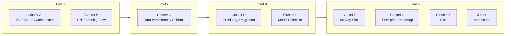

| Part | Clusters | Key Questions |
|---|---|---|
| **Part 1. Product & Architecture Strategy** | Cluster A + B | What are we building this year? How do the three stages connect? Why this deployment structure? |
| **Part 2. Data & System Design** | Cluster C | What gets stored where? Why is the schema designed this way? |
| **Part 3. Planning Logic & AI Inference** | Cluster D + E | How do we migrate Excel to Python? How do we select and execute models? |
| **Part 4. Execution, Roadmap, Risk, Non-Scope** | Cluster F + G + H + I | What is the 90-day plan? What is the Enterprise roadmap? What are the risks? What are we not building? |

---

## Table of Contents

| Section | Content |
|---|---|
| **1** | Deployment Strategy |
| **2** | MVP Scope & Architecture |
| **3** | End-to-End Flow |
| **4** | MVP → Enterprise Transition Strategy |
| **5** | Data Persistence Strategy |
| **6** | Multi-table Schema |
| **7** | Enterprise Scaling |
| **8** | Excel Logic Migration |
| **9** | Model Selection & Scenario Inference |
| **10** | Default Model Selection Criteria |
| **11** | Roles & 90-Day Execution Plan |
| **12** | Enterprise Upgrade Roadmap |
| **13** | Key Risks & Mitigation Plan |
| **14** | Intentional Non-Scope |
| **REF** | References |

## Key Decisions Summary

The following four decisions underpin the entire design.

> **Decision 1 — Deployment:** The Compute Layer is fixed on AWS Serverless (ECS Fargate + Step Functions + Aurora Serverless v2) regardless of data location. The Data Ingestion Layer will be determined after the source data location is confirmed.
>
> **Decision 2 — E2E Connection:** The three stages — Forecast → Purchase Planning → Production Planning — are executed sequentially via Step Functions. Inter-stage data passes through Aurora DB rather than a message queue. The rationale: DB persistence enables intermediate result queries, per-stage retry, and permanent lineage preservation.
>
> **Decision 3 — Reproducibility:** All execution results are stored immutably under `run_id`. `input_snapshot`, `model_id`, `model_params`, and `logic_version` are stored together to guarantee full reproduction of any historical result.
>
> **Decision 4 — Incremental Evolution:** The MVP structure (containers, modular monolith, Aurora, CI/CD) is not discarded during Enterprise transition. Layers are added and components are replaced. Each MVP design decision is a prerequisite for the following year's transition.

---

# Part 1. Product & Architecture Strategy

---

# Section 1. Deployment Strategy

## 1-1. Design Principle: Separating Compute from Data Ingestion

The assignment does not specify where source data (TRx history, inventory, safety stock, SKU/CMO master) is stored. Committing to a full deployment strategy before confirming data location creates the risk of redesigning the entire architecture if the assumption changes.

To mitigate this, the Compute Layer and Data Ingestion Layer are decided independently.

| Layer | Decision Method | Rationale |
|---|---|---|
| **Compute Layer** | Fixed on AWS Serverless | Provides a consistent compute environment regardless of data location |
| **Data Ingestion Layer** | Decided after confirming source data location | The optimal collection method differs depending on location (direct connection / batch extract / API pull) |

```mermaid
flowchart LR
    subgraph SRC["Source Data (Location TBD)"]
        D1["TRx / Demand History"]
        D2["Inventory / Safety Stock"]
        D3["SKU / CMO Master"]
    end

    subgraph ING["Data Ingestion Layer\n(Decided after location confirmed)"]
        I1["Case A: Already on AWS\n Direct connect or S3 copy"]
        I2["Case B: On-prem\nScheduled batch extract"]
        I3["Case C: External system\nAPI pull or file export"]
    end

    subgraph COMPUTE["Compute Layer\n(AWS Serverless — Fixed)"]
        C1["Web UI / API"]
        C2["Step Functions"]
        C3["ECS Fargate\n(Inference & Planning)"]
        C4["Aurora Serverless v2 + S3"]
    end

    SRC --> ING
    ING --> COMPUTE
```

---

## 1-2. Deployment Option Comparison

| Criteria | Pure On-prem | On-prem/AWS Hybrid | **AWS Serverless (Selected)** |
|---|---|---|---|
| Infrastructure management | Direct OS patching, runtime management | Partially shared | Delegated to AWS |
| ML library environment | Reproducibility issues recur | Partially resolved | Fully isolated via container image |
| Scaling | Manual (performance degrades with concurrent jobs) | Partially automated | Automatic (ECS task auto-scaling) |
| Deployment cycle | Slow (server access, process restart) | Medium | Fast (code push → immediate deployment) |
| Cost model | Fixed (billed even during idle) | Mixed | Usage-based (optimal for MVP traffic) |
| Enterprise transition | Requires full redesign | Partial continuity | Incremental expansion of current structure |

**Rationale for excluding On-prem:** AI model inference involves complex dependencies on Python runtime and ML libraries (Prophet, XGBoost, pandas). Managing these directly on On-prem consumes AI Engineer resources on infrastructure operations, preventing focus on model and service development.

---

## 1-3. Deployment Topology

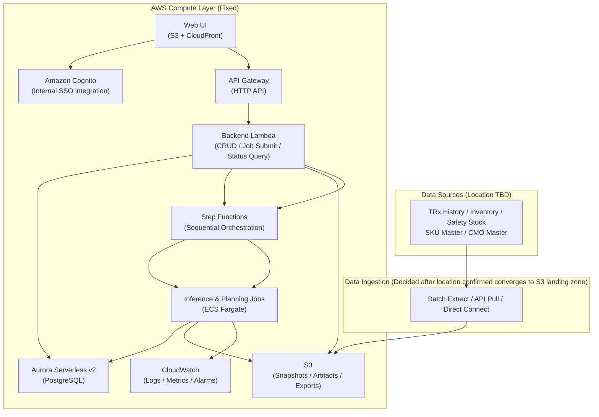

---

# Section 2. MVP Scope & Architecture

## 2-1. MVP Purpose and Success Criteria

**Core validation question:**
When Forecast → Purchase Planning → Production Planning are connected in a single web workflow, can actual SCM/BizOps users replace their existing Excel-based operations?

| Success Criterion | Measurement | Importance |
|---|---|---|
| **Workflow connection** | Forecast → Purchase → Production executes automatically end-to-end | Manual copy-paste between stages provides no advantage over Excel |
| **Excel parity** | Numerical difference between Excel and Python output is within the tolerance threshold agreed with SME | Reference point to distinguish bugs from intentional model improvements |
| **Plan traceability** | Model, scenario, input, and output are traceable per run | Results that cannot be traced cannot serve as a decision-making basis |
| **User autonomy** | Selected users can execute runs independently without engineer involvement | Requiring an engineer present constitutes a demo, not a tool |
| **Operational sustainability** | Structure maintainable by a small engineering team | Excessive complexity prevents MVP completion |

---

## 2-2. In Scope

### A. AI-based Demand Forecasting

| Feature | Engineering Considerations |
|---|---|
| SKU-level forecast | Execution time varies significantly with SKU count and model complexity. Start with serial execution in MVP; evaluate parallelization based on observed runtime |
| Model selection (statistical / ML) | Each model type differs in input data format, preprocessing method, model loading approach, and output post-processing. `model_id` determines which preprocessing → loader → post-processing pipeline to execute |
| Scenario input (LOE, competitor, etc.) | Assumptions stored as JSONB to allow field additions without schema changes |
| Run versioning | Store `input_snapshot_s3_uri`, `model_id`, `scenario_id` per run. Model artifacts stored in S3 at `models/{model_id}/v{version}/artifact.pkl`. Rollback requires only a `model_id` change |
| Baseline vs scenario comparison | `run_id`-based comparison query API to compare two runs with identical conditions and differing scenario only |

### B. Purchase Planning

| Feature | Engineering Considerations |
|---|---|
| Excel logic migration | openpyxl: does not evaluate formulas. xlwings: Linux incompatible (requires Excel installation). → pandas full rewrite is the only viable option |
| Inventory / safety stock integration | Data collection method to be determined after confirming source data location. Collection frequency and its impact on planning output to be confirmed during SME interviews |
| Manual quantity adjustment | When a planner modifies an order quantity, the original value is preserved and the adjusted value with its reason are recorded separately in the `plan_override` table. Overwriting the original value makes it impossible to restore the previous state |
| Plan versioning | Track `forecast_run_id → purchase_plan_id` lineage |

### C. Production Planning

| Feature | Engineering Considerations |
|---|---|
| Rule-based CMO allocation | This is the logic that determines which CMO produces which SKU and in what quantity. The allocation criteria are identified through SME interviews first, then translated directly into code. Results are validated with planners before being refined in the following year |
| CMO constraints (lead time, capacity, MOQ) | Constraint violations are flagged via `constraint_flag`, not auto-corrected. Final judgment is made by SME |
| Plan versioning | Track `purchase_plan_id → production_plan_id` lineage |

---

## 2-3. Out of Scope

| Excluded Item | Rationale | This Year's Alternative |
|---|---|---|
| **Real-time Streaming inference** | SCM planning prioritizes reproducibility over real-time. Kafka setup and exactly-once processing are irrelevant to MVP core purpose | Async batch job (minute-level) |
| **Full MLOps platform** | Automated model drift detection and retraining are unsustainable without dedicated operations staff | `MODEL_REGISTRY` table + manual retraining |
| **Microservices decomposition** | Service count = deployment complexity + distributed transactions + distributed log tracing. Operations overhead exceeds development overhead for a small team | Modular monolith |

---

## 2-4. Component Selection Rationale

### Design Constraints

**Constraint 1. Execution time:** Forecast inference and planning computation may run for tens of seconds to minutes. API Gateway HTTP API maximum timeout is **29 seconds** (not extendable). HTTP request-response processing is not feasible. **Async execution is required.**

**Constraint 2. Compute resources:** Container images including ML libraries (Prophet, XGBoost, pandas) are 1–3 GB. Lambda maximum memory is **10,240 MB** and maximum execution time is **15 minutes**. As SKU count and model complexity grow, these limits can be exceeded. **Lambda is not suitable for inference.**

---

### ① Lambda vs ECS Fargate — Role Separation Criteria

| Criteria | Lambda | ECS Fargate |
|---|---|---|
| Maximum execution time | **15 min (900 sec)** | **Unlimited** |
| Maximum memory | **10,240 MB** | **120 GB** |
| Cold start (Python container) | 1–5 sec (proportional to image size) | **30–90 sec** (ENI provisioning + image pull) |
| ML library loading | image 1–3 GB → cold start increases significantly | Natural fit |
| Suitable workload | Short, lightweight tasks | Long, heavyweight tasks |
| Billing | Per millisecond | vCPU + memory time |

```
Role Assignment:
  API CRUD, validation, job trigger   → Lambda   (short and stateless)
  Workflow state management           → Step Functions
  Forecast inference (hundreds of SKUs) → ECS Fargate Task
  Purchase planning                   → Start with Lambda; evaluate Fargate migration based on observed runtime
                                           (Migration threshold: runtime > 5 min or memory > 8 GB)
  Production planning                 → ECS Fargate Task
```

> **Fargate cold start impact:** Fargate task initialization takes 30–90 seconds (ENI provisioning + ECR image pull). In the MVP, this is handled with a 202 Accepted + polling pattern with progress status displayed in the UI, keeping it within acceptable UX bounds. Short-term mitigation: apply zstd compression to ECR images and minimize base image layers. For Enterprise: evaluate pre-warmed task pools or ECS Service (always-on) patterns.

---

### ② Step Functions vs Apache Airflow (MWAA) — Orchestration Selection

| Criteria | **Step Functions (Selected)** | Apache Airflow (MWAA) |
|---|---|---|
| Fixed infrastructure cost | None (billed per state transition) | Environment uptime cost (micro tier added Nov 2024, management overhead remains) |
| Management burden | Serverless | Environment setup, package management required |
| Learning curve | Low (JSON/YAML state machine) | Medium (Python DAG authoring) |
| Failure handling | Built-in (Retry, Catch, Timeout, Compensate) | Built-in |
| Suitable for | Event-driven, few-step sequential workflows | Complex DAGs, data pipeline-centric workloads |

**Rationale for not selecting Airflow:** The 3-stage sequential workflow (Forecast → Purchase → Production) does not justify Airflow's complexity and infrastructure management overhead. Airflow introduction will be reconsidered when retraining pipelines and feature engineering DAGs become necessary.

> **Step Functions Workflow Type: Standard vs Express**
>
> | Item | Standard Workflow | Express Workflow |
> |---|---|---|
> | Maximum execution time | **1 year** | **5 minutes** |
> | Execution history retention | 90 days | CloudWatch Logs only |
> | Billing | Per state transition | Per execution + duration |
> | Suitable for | Long-running batch, audit trail required | High-frequency short-lived executions |
>
> **SCM Planning MVP uses Standard Workflow.** Forecast inference runs in the order of minutes and execution history traceability is required. Express Workflow's 5-minute limit makes it unsuitable for the full ML inference pipeline.

---

### ③ Aurora Serverless v2 vs RDS PostgreSQL — DB Selection

| Criteria | **Aurora Serverless v2 (Selected)** | RDS PostgreSQL |
|---|---|---|
| Cost model | ACU-based, auto-scales with load | Fixed instance cost structure |
| MVP traffic handling | Auto-adjusts to irregular usage patterns | Fixed size — either over-provisioned or overloaded |
| Idle cost | Storage only (zero-scale support added Nov 2024) | Instance billed continuously (~$30/month+) |
| Adding Read Replica | Native Aurora-based scaling | Separate RDS instance required, migration needed |
| Enterprise transition | Seamless migration to Aurora Provisioned | Migration to Aurora required |

**Rationale for Relational DB:** Tracking the `forecast_run → forecast_result → purchase_plan → production_plan` lineage requires JOIN queries. The inter-stage connections must be directly queryable from DB to allow the UI to surface "which forecast this plan originated from."

**Rationale for Aurora Serverless v2:** MVP traffic patterns are irregular — a few executions during the day, near-zero at night. Aurora Serverless v2's ACU-based auto-scaling minimizes idle costs while accommodating unpredictable internal demo usage. The path to adding a Read Replica in the Enterprise phase is natural within the Aurora ecosystem.

> **Aurora Storage Durability Note:** Aurora replicates the storage layer across multiple AZs, providing strong data durability. However, application-level high availability requires separate design considerations: writer failover configuration, reader endpoints, and connection retry strategies. Storage replication does not automatically guarantee instance-level high availability.

---

### ④ Modular Monolith vs Microservices

The actual cost of applying Microservices to an MVP:

| Cost Item | Detail |
|---|---|
| **Deployment complexity** | Each service requires its own CI/CD pipeline, container registry, and deployment workflow |
| **Distributed transactions** | If Forecast → Purchase → Production run in different services, mid-stage failures require Saga pattern rollback |
| **Distributed log tracing** | A single request spanning multiple services requires correlation ID-based distributed tracing (X-Ray or equivalent) |
| **Team size mismatch** | Microservices provide value when each service has a dedicated team. A small team operating multiple services only accumulates overhead |

**Decision:** Start with a Modular Monolith and extract services when workload characteristics and ownership boundaries are clearly established.

```
backend/
  api/                 ← HTTP endpoints
  forecasting/         ← Model inference logic
  purchase_planning/   ← Excel logic migration
  production_planning/ ← Rule-based CMO logic
  scenario/            ← Scenario management
  persistence/         ← DB access layer
  jobs/                ← Async job submission/status query
```

With clear module boundaries, extracting `forecasting/` into a separate service later requires minimal interface changes.

---

## 2-5. Full Logical Architecture

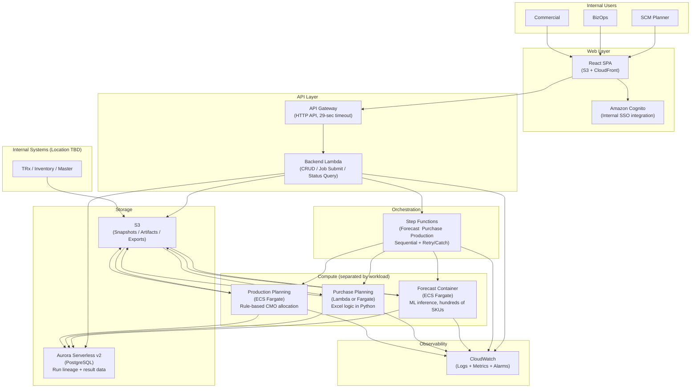

---

## 2-6. Async Execution Flow — 202 Accepted + Polling Pattern

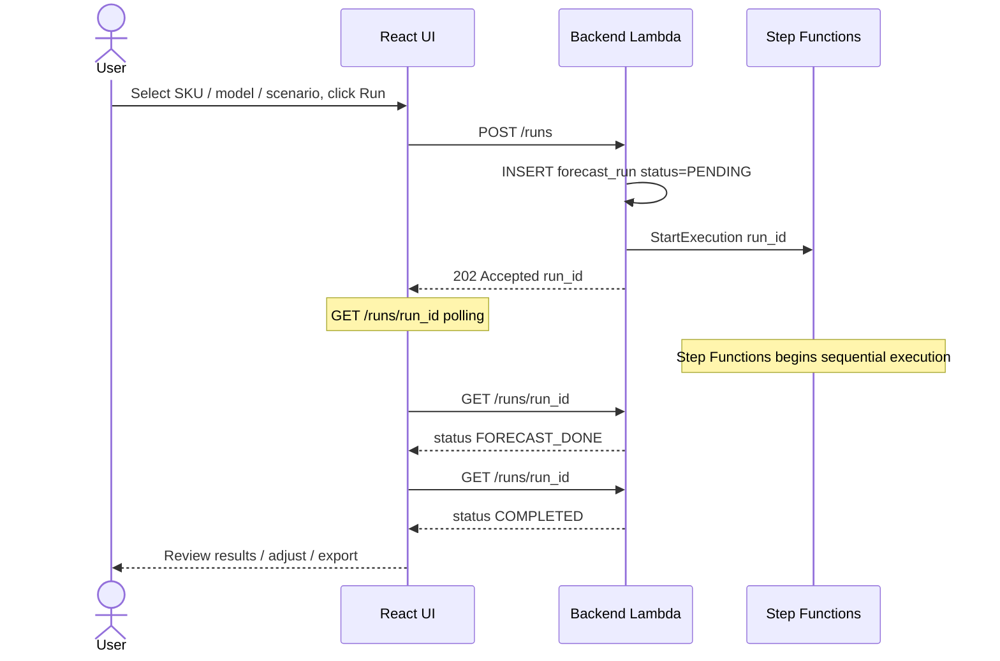

**Rationale for 202 Accepted + polling:** API Gateway HTTP API timeout is 29 seconds. Forecast inference at the order of minutes makes synchronous response impossible. Returning `run_id` immediately and having the client poll for status allows the UI to display real-time progress.

---

# Section 3. End-to-End Flow

## 3-1. Design Principles

### Principle 1. Sequential Execution

Parallel execution is not possible because each stage's output is the next stage's input.

```
Forecast output (per-SKU predicted demand)
    → Purchase Planning: uses forecast output to calculate order quantities
        → Production Planning: uses order quantities to calculate CMO production schedule
```

Step Functions sequential state is a natural fit for this pattern.

### Principle 2. Inter-stage Data Transfer via DB

| Method | Problem |
|---|---|
| **Direct function call** | Tight coupling. Data lost on failure. Intermediate results not queryable |
| **Message queue** | Messages destroyed after consumption. Intermediate results not queryable. Re-publishing required for retry |
| **DB passthrough (Selected)** | Stage 1 results persist even if Stage 2 fails. Intermediate results queryable. Lineage permanently preserved |

---

## 3-2. Per-stage Input/Output Definition

### Stage 1. AI-based Demand Forecasting

| Type | Content | Note |
|---|---|---|
| **Input** | Historical TRx | Specified in assignment |
| **Input** | Other relevant data | To be determined with AI Scientist. Start with TRx only in initial MVP |
| **Input** | User-selected model (statistical or AI) | Specified in assignment |
| **Input** | Business scenario (LOE, indication expansion, competitor event) | Specified in assignment |
| **Output** | Per-SKU short/mid-term forecast (forecast_qty, lower_bound, upper_bound) | Specified in assignment |

### Stage 2. Purchase Planning

| Type | Content | Note |
|---|---|---|
| **Input** | Stage 1 forecast results | Specified in assignment |
| **Input** | U.S. inventory | Specified in assignment |
| **Input** | Safety stock | Specified in assignment |
| **Input** | Planned supply | Specified in assignment |
| **Input** | Events | Specified in assignment. Specific items identified through SME interviews |
| **Input** | Other relevant factors | To be determined through SME interviews |
| **Logic** | Migrate existing Excel-based planning logic to pandas | Specified in assignment |
| **Output** | SKU-level purchase plan (suggested_purchase_qty) | Specified in assignment |

### Stage 3. Production Planning

| Type | Content | Note |
|---|---|---|
| **Input** | Stage 2 purchase plan results | Specified in assignment |
| **Input** | Multiple CMOs | Specified in assignment |
| **Input** | Lead time (per CMO) | Specified in assignment |
| **Input** | Capacity (per CMO) | Specified in assignment |
| **Input** | MOQ (minimum order quantity per CMO) | Specified in assignment |
| **Input** | Other production constraints | To be determined through SME interviews |
| **Logic** | Rule-based CMO allocation (this year) | Specified in assignment |
| **Output** | Per-CMO production plan + constraint_flag | Specified in assignment |

---

## 3-3. User-facing Business Flow

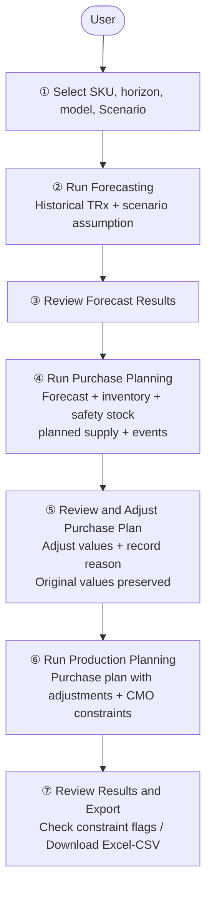

Rationale for placing adjustment after Purchase Planning: Reviewing the purchase plan, adjusting select values, and applying those adjustments to Production Planning matches the natural business workflow.

---

## 3-4. Internal System Execution Flow

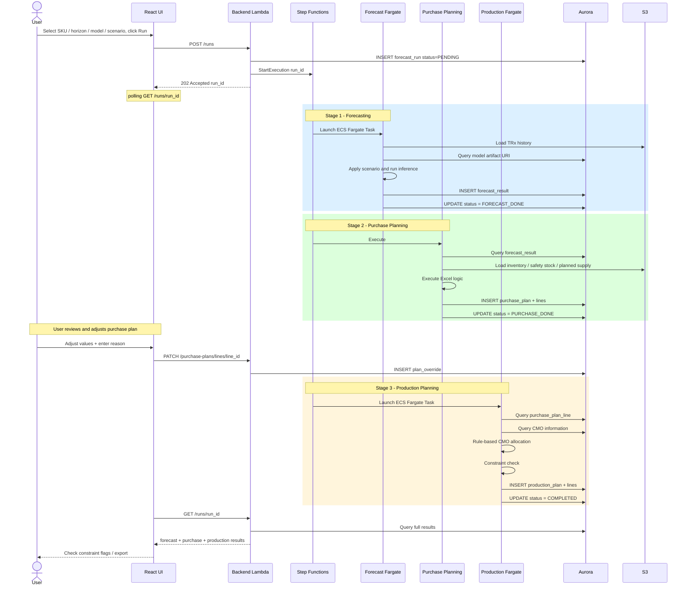

---


## 3-5. Scenario Propagation

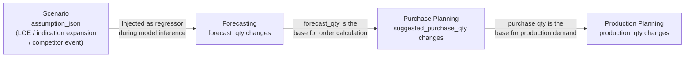

The scenario is injected once at the Forecasting stage and its effect propagates downstream naturally. Purchase Planning and Production Planning do not directly reference the scenario. The forecast output already incorporates the scenario's impact.

| Scenario Type | Change in Forecasting | Purchase Planning | Production Planning |
|---|---|---|---|
| **LOE** | Post-LOE TRx decline reflected → `forecast_qty` decreases | Lower `forecast_qty` → `suggested_purchase_qty` decreases | Lower purchase qty → production schedule reduced |

---

## 3-6. Failure Handling

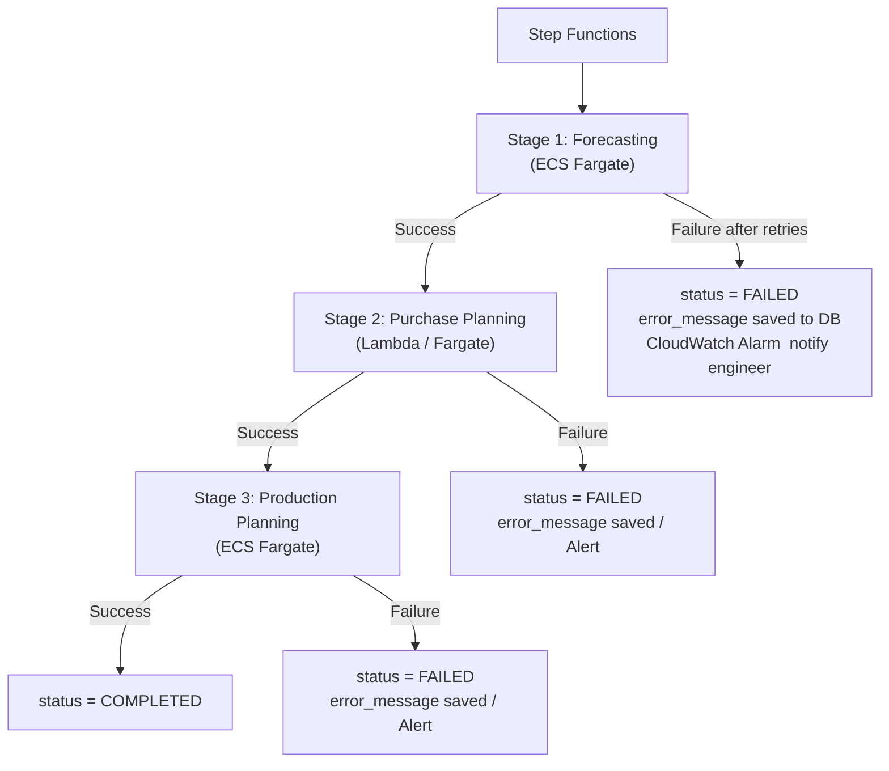

| Design Principle | Rationale |
|---|---|
| Stage 2 failure does not trigger Stage 1 re-run | `forecast_result` is preserved in DB, allowing retry from Stage 2. Core advantage of DB passthrough design |
| `error_message` saved to DB | Enables UI to display the failure reason to the user |
| CloudWatch Alarm configured | Immediately notifies the responsible engineer upon failure |

---

## 3-7. End-to-End Structure Summary

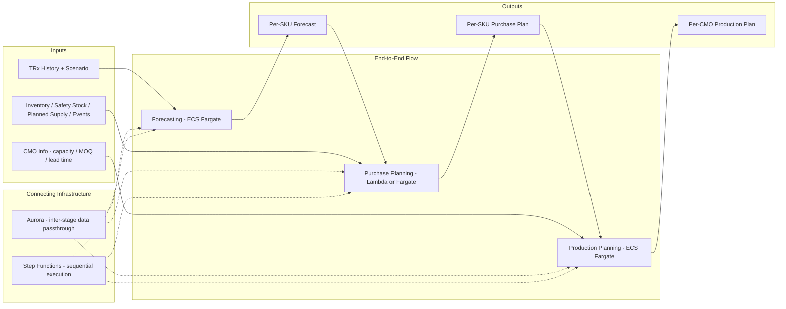

---

# Section 4. MVP → Enterprise Transition Strategy

## 4-1. Transition Direction

The core principle for transitioning MVP to Enterprise is to **add layers and replace components rather than discard the existing structure**. Each MVP design decision is a prerequisite for the following year's transition.

## 4-2. Per-component Transition Path

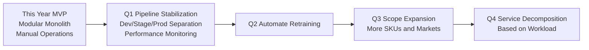

## 4-3. MVP Design Decisions as Enterprise Prerequisites

| MVP Design Decision | How It Enables Enterprise Transition |
|---|---|
| `run_id` assigned to all runs | Foundation for lineage tracking. Without it, data governance in the Data Lake is impossible |
| `input_snapshot_s3_uri` stored | Prerequisite for result reproduction, audit, and backtesting |
| `model_id` stored in all results | Enables before/after comparison when models change |
| `plan_override` in a separate table | Basis for user intervention history and audit trail |
| Containerized inference (Fargate) | Containers migrate as-is to SageMaker / AWS Batch |
| Clear API boundaries | Enables independent extraction of components as needed |

---

# Part 2. Data & System Design

---

# Section 5. Data Persistence Strategy

## 5-1. Storage Target Definition

| Storage Target | Specific Content | Note |
|---|---|---|
| Forecast results | Per-SKU × period predicted demand, upper/lower bounds | Model execution output |
| Scenarios | Business assumption combinations (LOE, indication expansion, competitor event, etc.) | User-defined |
| Purchase plans | Per-SKU × period recommended order quantities, calculation inputs, override history | Generated from forecast |
| Production plans | Per-CMO × SKU production schedules, constraint flags | Generated from purchase plan |
| Model metadata | Model name, version, artifact location, performance metrics, status | Registered by AI Scientist |
| User inputs | Selected SKU list, horizon, model, scenario, override values and reasons | Execution parameters + modification history |

---

## 5-2. DB vs S3 Decision Framework

Storage location is determined by evaluating three criteria together.

| Criterion | DB preferred | S3 preferred |
|---|---|---|
| **① UI direct query** | Row-level filtering, JOIN, status polling required | UI does not query directly |
| **② Data volume** | Tens of thousands to millions of rows | Binary files, tens of MB or more |
| **③ Query latency tolerance** | Sub-second response required | Seconds tolerable (download/reproduction purpose) |

When UI queries are required and response speed matters but data volume is large, a Hybrid approach is used.
- **DB:** Minimum aggregated results needed for UI, indexed key columns
- **S3:** Raw full output for reproduction/audit, binary artifacts

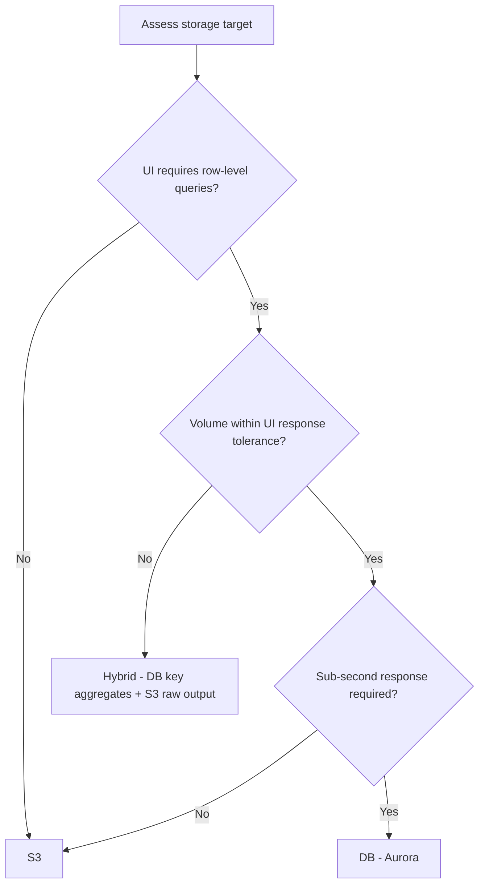

---

## 5-3. Storage Location Decision Table

| Storage Target | Location | Rationale |
|---|---|---|
| Forecast result values (SKU × period × qty) | **DB** | UI filtering and comparison queries. Within MVP volume range |
| Purchase plan lines | **DB** | Row-level override input required |
| Production plan lines | **DB** | Constraint flag filtering required |
| Run metadata (status, model_id, scenario_id) | **DB** | Polling, JOIN |
| Scenario assumptions | **DB (JSONB)** | "Which assumption produced this result?" queries needed |
| Model metadata | **DB** | Dropdown display, version queries |
| User inputs (selected SKUs, horizon, model parameters) | **DB (JSONB)** | Run reproduction and tracing |
| Override history | **DB** | Audit trail queries |
| Source data snapshots (TRx, inventory) | **S3 (Parquet)** | Not directly queried by UI. For reproduction |
| Model artifacts (.pkl, .joblib) | **S3** | Binary. Not queried by UI |
| Export results (Excel/CSV) | **S3** | Presigned URL download |
| Inference job full raw output | **S3 (Hybrid)** | Key metrics in DB, raw full output in S3 |

---

## 5-4. Versioning Strategy

**Principle:** All results are stored immutably under `run_id`. Existing rows are never overwritten.

**Rationale:** If past results cannot be reproduced in SCM planning, the system cannot serve as a trustworthy decision-making tool. Full reproduction requires the input data, model, model parameters, scenario, and logic version from the time of execution.

```
When the same SKU and model are re-run:
  → The existing forecast_run is not modified
  → A new row is created with a new forecast_run_id
  → Both runs can be compared in the UI
```

**Override handling:**
When a `purchase_plan_line` value is modified, the existing row is not updated. The change is recorded separately in the `plan_override` table (original / overridden / field_name / reason / who / when). Multiple modifications to the same line are each stored as separate rows. When querying from the UI, the effective value is calculated by applying the most recent `overridden_at` value for the given `line_id + field_name`.

**Retention Policy:**
To manage data growth from immutable storage:

Example: 300 SKUs × 24 months × 5 runs/day × 250 days = **approximately 9M rows/year** (`forecast_result`)

- Runs older than 12 months: archived to S3 Parquet via nightly batch job and deleted from DB
- Archive status tracked via `forecast_run.archived_at` column
- In the Enterprise phase, archived runs are registered in Glue Data Catalog / Athena external tables for SQL queries

---

## 5-5. Input Snapshot Strategy

The S3 paths of the input data used in a Forecast run are stored together in `forecast_run`. When reviewing "what data was used in that run" or re-running under the same conditions, these paths are referenced. To accommodate future additions to input data types, paths are bundled in JSONB rather than stored as separate URI columns.

Currently there are two types — TRx and inventory — but if events or other data are added later, only a new key inside the JSON is needed with no table structure changes.

```json
{
  "trx":       "s3://bucket/snapshots/RUN-001/trx_snapshot.parquet",
  "inventory": "s3://bucket/snapshots/RUN-001/inventory_snapshot.parquet",
  "events":    "s3://bucket/snapshots/RUN-001/events_snapshot.parquet"
}
```

**Rationale for Parquet:**

| Item | CSV | Parquet |
|---|---|---|
| File size | Large (text storage) | Small (columnar compression) |
| Reload speed | Slow (full parsing) | Fast (column pruning) |
| Schema information | None (type inference required) | Embedded in file |
| Athena query cost | High (full scan) | Low (column pruning) |

Parquet is superior for schema preservation, compression ratio, and Athena integration. CSV offers convenience for direct human-readable debugging but is unsuitable as an operational snapshot format.

---


---

# Section 6. Multi-table Schema (MVP)

## 6-1. Single Operational DB Rationale

The MVP uses a Single Operational DB: all tables reside in a single Aurora instance.

| Alternative | Problem |
|---|---|
| Domain-separated DBs | Cannot track `forecast_run → purchase_plan → production_plan` lineage via JOIN. Application must call multiple DBs sequentially and assemble results. Increases operational DB count |
| NoSQL (DynamoDB) | No JOIN. Lineage tracking and version comparison queries become complex. GSI redesign required when access patterns change |
| **Single Operational DB (Selected)** | Free JOINs. Lineage tracking is natural. Flexible schema evolution. Minimum operational burden |

**Core value of Single DB — lineage tracking in a single query:**

```sql
-- "What scenario and model did this production_plan_line originate from?"
SELECT ppl.sku_id, s.name AS scenario, mr.model_name, fr.model_params_jsonb
FROM production_plan_line ppl
JOIN production_plan pp    ON ppl.production_plan_id = pp.production_plan_id
JOIN purchase_plan pup     ON pp.purchase_plan_id = pup.purchase_plan_id
JOIN forecast_run fr       ON pup.forecast_run_id = fr.forecast_run_id
JOIN scenario s            ON fr.scenario_id = s.scenario_id
JOIN model_registry mr     ON fr.model_id = mr.model_id
WHERE ppl.line_id = :target_line_id;
```

With domain-separated DBs, this lineage would need to be assembled in application code by calling multiple DBs in sequence.

---

## 6-2. Intentional Simplifications in MVP

| Simplified Item | MVP Approach | Enterprise Addition/Change |
|---|---|---|
| Production planning logic | Rule-based (conditional branching) | To be determined based on next year's requirements |
| DB configuration | Single Aurora instance | Read Replica (with routing and lag design) |
| Analytics queries | None (simple SELECT from Aurora) | S3 Data Lake + Athena + Glue Data Catalog |
| ML feature management | None (computed from raw data each time) | Offline Feature Store to be evaluated first |
| Model retraining | Manual (AI Scientist directly) | Automated retraining pipeline |
| logic_version management | Team manually assigns semantic version | CI/CD auto-injects git commit SHA |
| Multi-tenancy | None (single organization) | Add `organization_id` |

---

## 6-3. Schema Design (ERD)

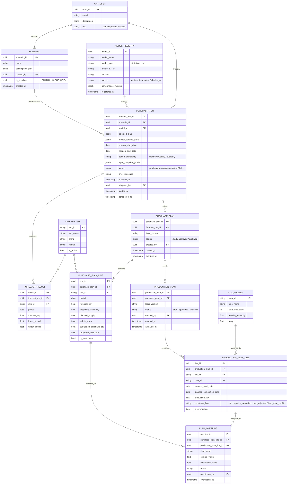

---

## 6-4. Key Table Design Decisions

### APP_USER — Avoiding Reserved Word Conflicts

`USER` can conflict with PostgreSQL reserved words, causing errors or requiring quoting in `CREATE TABLE user`. Naming the table `app_user` avoids this issue entirely.

### FORECAST_RUN.model_params_jsonb — Full Reproducibility

`model_id` identifies the model version, but the parameters used by the AI Scientist at training time must also be recorded for the run to be fully reproducible. `model_id` alone does not capture "what configuration was used."

### PURCHASE_PLAN_LINE — Full Reproducibility of Order Calculation

Base order quantity formula:
```
suggested_purchase_qty
  = max(0, forecast_qty + safety_stock - beginning_inventory - planned_supply)
```

Without `beginning_inventory`, this formula cannot be reproduced. All inputs used in the calculation are included in the row to enable tracing of "why this order quantity was generated."

### SCENARIO.assumption_json — JSONB Storage

| Method | Advantage | Disadvantage |
|---|---|---|
| Per-column separation | Type safety | ALTER TABLE required for each new assumption type |
| EAV table | High type safety | Complex queries (pivot required) |
| **JSONB (Selected)** | Extensible without schema migrations | Type validation at application level |

### PLAN_OVERRIDE — Cumulative Modification History

Each time a planner modifies a value, a new row is added rather than overwriting the original. The full modification history is queryable, and the most recent value is applied as the effective value. A DB-level CHECK constraint ensures that exactly one of purchase_plan_line or production_plan_line is referenced per row.

### SCENARIO.is_baseline — PARTIAL UNIQUE INDEX

`is_baseline = true` marks the run condition with no scenario applied — the reference condition. If multiple rows have this value, a reference query returns multiple rows. Enforcing this at the DB level with a PARTIAL UNIQUE INDEX is safer than application-level validation.

### logic_version — Environment Variable Injection

The current logic version is automatically recorded when purchase_plan and production_plan records are created. When logic changes, the version is bumped and injected as an environment variable at deployment. In the Enterprise phase, the CI/CD pipeline auto-injects the git commit SHA.

---

## 6-5. Lineage Tracking

Because all tables reside in a single Aurora instance, a single JOIN query can trace any production_plan_line back to its originating scenario, model, and input data. Override history is equally queryable through the same structure.

---

# Section 7. Enterprise Scaling

The MVP starts with a single Aurora instance. As users and data grow, three problems emerge in sequence.

| When | Problem |
|---|---|
| User count increases | Read and write queries share the same DB, causing response latency |
| Data accumulates | Historical data (forecast results, etc.) increases DB cost and degrades performance |
| Analytics queries grow | Heavy queries like "full-year forecast accuracy" interfere with operational queries |

When these problems actually appear, the expansion direction is: separate read/write, archive historical data separately, and isolate analytics queries. The specific technology choices will be made based on the actual bottleneck observed at that time.

This is why the MVP establishes structures like `run_id`, `input_snapshot_jsonb`, and `archived_at` from the start. Without these, lineage breaks when data is separated or migrated.

---

# Part 3. Planning Logic & AI Inference Implementation

---

# Section 8. Excel Logic Migration & Web Service Implementation

## 8-1. Complexity of Excel Migration

The actual structure of the SCM planning Excel is unknown until SME interviews are conducted. In practice, operational Excel files often contain a combination of cross-sheet references, manual input cells, and calculation order dependencies beyond simple formulas. The migration work should be approached with the assumption that it may be more complex than it appears on the surface.

## 8-2. Migration Approach Comparison

| Approach | Description | Limitation |
|---|---|---|
| **openpyxl** | Read/write xlsx files in Python | Does not evaluate formulas. Reads only the last cached value stored in the cell |
| **xlwings** | Controls Excel COM objects from Python | Windows/Mac only. Linux server incompatible. Excel installation required |
| **formulas library** | Parses and evaluates Excel formula strings in Python | Limited coverage of complex nested formulas, named ranges, and cross-sheet references |
| **pandas/numpy full rewrite (Selected)** | Understand Excel logic and implement an equivalent in Python | High initial effort but the only practically viable option |

**Rationale for selecting pandas/numpy full rewrite:** Production servers are Linux-based (AWS Fargate/Lambda). Excel cannot be installed on a server, and COM objects are unavailable. openpyxl does not evaluate formulas. The formulas library cannot handle production-level Excel complexity. The higher initial effort of a full rewrite produces results that are testable, version-controlled, and stably executable on a server.

---

## 8-3. Migration Execution Process

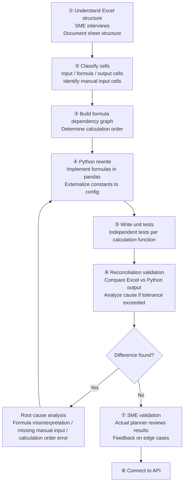

### Step 1. SME Interviews — Required Items

| Item | Purpose |
|---|---|
| Which sheets are inputs and which are outputs | Understand the full data flow |
| Where are manual input cells (no formula) | Cannot be reproduced in code; must be handled as API parameters or config |
| Distinction between actively used sheets and legacy sheets | Avoid wasting time migrating unused sheets |
| Location of periodically changing assumption values | Externalize to config so SME can change them without code deployments |
| Existence of special cases or exception handling | Prevent omission of exception logic |

### Step 2. Manual Input Cell Classification and Handling

| Nature | Handling Method |
|---|---|
| Values entered by user on each run | API request body parameter |
| Periodically changing assumption values | DB config table (editable from UI) |
| Rarely changing constants | S3 YAML config (version-controlled by engineer) |

In MVP, start with S3 YAML. Items identified as "changed every planning cycle" during SME interviews are handled as DB config tables from the start.

### Step 3. Config Externalization

Constants hardcoded inside Excel formulas are extracted to config rather than embedded in code. Values must be changeable without a deployment so that planners can manage them directly. Items identified in SME interviews as "changed every planning cycle" are handled as DB config tables from the start.

### Step 4. Reconciliation Validation

Run both Excel and Python against the same input data and compare outputs. Any result exceeding the agreed tolerance threshold is treated as a logic misinterpretation and investigated. This validation is included in CI/CD so it runs automatically on every code change.

---

## 8-4. Anticipated Migration Error Types

| Error Type | Cause | Resolution |
|---|---|---|
| **Calculation order error** | B references A, but B is computed first | Rebuild dependency graph and correct order |
| **Missing manual input cell** | Value entered by SME not reflected in code | Add the value as config or API parameter |
| **Unrecognized Named Range** | Names defined in Excel Name Manager overlooked | Extract full list from Name Manager and reflect in config |
| **Conditional branching misinterpretation** | Nested IF condition order misunderstood | Confirm the real-world meaning of each condition with SME |
| **Rounding difference** | Display precision in Excel affects actual computation | Apply identical rounding precision in Python using `round()` |
| **Empty cell handling difference** | Excel treats empty cells as 0 in some contexts | Explicitly handle with pandas `.fillna(0)` or `.fillna(np.nan)` |

---

# Section 9. Model Selection & Scenario Inference

## 9-1. Role Boundaries

| Role | Responsibility Scope |
|---|---|
| **AI Scientist** | Model development, training, performance evaluation, artifact registration |
| **AI Engineer** | Build model selection and execution infrastructure. Provide the service layer enabling users to select and run models |

This section addresses **how to select and execute models**, not what models to build.

---

## 9-2. MODEL_REGISTRY

| Field | Description |
|---|---|
| `model_id` | Unique identifier |
| `model_name` | Display name in UI |
| `model_type` | statistical / ml (used for loader selection) |
| `artifact_s3_uri` | S3 path where model file is stored |
| `version` | Model version (1:1 mapping with model_id. New model_id issued on retraining) |
| `status` | active / deprecated / challenger |
| `performance_metrics` | MAPE, RMSE, etc. (registered by AI Scientist after training) |
| `registered_at` | Registration timestamp |

- `status = active`: exposed in UI dropdown
- `status = deprecated`: preserved for existing run lineage tracing only
- `status = challenger`: newly registered model under performance evaluation

**Version management principle:** When a model is retrained, a new `model_id` is registered rather than modifying the existing one. Overwriting the version makes it impossible to trace which model version produced past forecast runs.

---

## 9-3. S3 Artifact Naming Convention

```
s3://[bucket]/models/
  {model_type}/
    {model_name}/
      v{version}/
        model.{ext}       ← Model file (.json, .pkl, .pt, etc.)
        requirements.txt  ← Python package versions required by this model
        metadata.json     ← Training date, training data period, evaluation metrics, etc.
```

Since `artifact_s3_uri` is stored in MODEL_REGISTRY, the path structure alone must make the model identifiable.

---

## 9-4. Runtime Model Dispatch

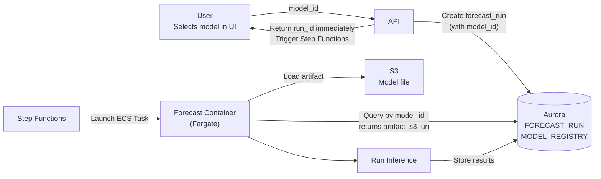

---

## 9-5. Model Loading: Factory Pattern

Each model type has a different loading method (Prophet: `.json`, sklearn: `.pkl`, PyTorch: `.pt`). A Factory pattern selects the correct loader based on `model_type`.

```python
class ModelFactory:
    @staticmethod
    def load(model_type: str, artifact_path: str):
        if model_type == "prophet":
            return ProphetLoader.load(artifact_path)
        elif model_type == "sklearn":
            return SklearnLoader.load(artifact_path)
        elif model_type == "xgboost":
            return XGBoostLoader.load(artifact_path)
        else:
            raise ValueError(f"Unsupported model_type: {model_type}")
```

**Rationale for Factory Pattern:** Adding a new model type requires only registering a new loader in `ModelFactory`. Scattered if/else branching risks omissions when adding new types, as modification locations are spread across the codebase.

---

## 9-6. Inference Failure Handling

| Failure Case | Handling |
|---|---|
| Artifact not found on S3 | `FORECAST_RUN.status = "failed"`, `error_message` recorded |
| Model file corrupted | Same handling |
| Exception during inference (data format mismatch, etc.) | Same handling |
| Container OOM | Same handling |

Recording failure reasons in DB and surfacing them in the UI is the most important design decision for reducing debugging time. Engineers are notified immediately via CloudWatch Alarm or Slack webhook.

---

## 9-7. Scenario Inference Implementation

The infrastructure receives scenario parameters (e.g., LOE effective date, market share shift) via `assumption_json` and passes them to the model at execution time. How the model actually incorporates the scenario is decided by the AI Scientist. The AI Engineer's responsibility is to build the interface that can execute whatever approach is agreed upon.

## 9-8. Managing Assumption Value Sources

```
Value source types:

1. SME enters at scenario creation time
   → Received as fields in assumption_json. UI provides input form.

2. Default values based on historical precedents
   → Stored in DB config table. SME can modify from UI.

3. External data (competitor info, market data)
   → Handled as SME manual input in MVP.
```

```json
{
  "scenario_type": "LOE",
  "effective_date": "2025-Q3",
  "affected_skus": ["SKU-A", "SKU-B"],
  "adjustment_method": "feature_injection",
  "assumptions": {
    "source": "sme_input",
    "estimated_share_loss_pct": 30,
    "input_by": "planner_user_id_123",
    "input_at": "2025-05-24T09:00:00Z"
  }
}
```

---

## 9-9. Scenario Information Flow

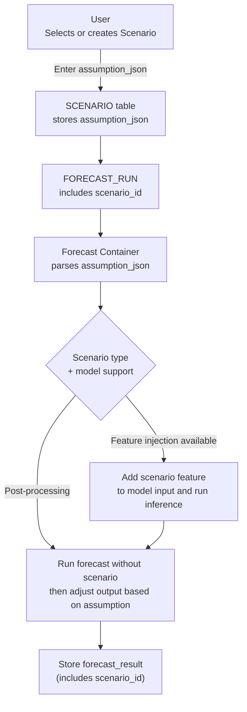

---

## 9-11. Champion / Challenger Operation

**MVP operation (manual):**
1. AI Scientist trains a new model and registers it as `challenger`
2. Engineer compares MAPE of challenger and active model on the same test dataset
3. If challenger exceeds improvement threshold, promote to `active`; mark existing model as `deprecated`

**Enterprise phase (automated):**
Automated retraining pipeline, automated A/B evaluation, and automated promotion criteria. Manual processes are established in MVP before automating.

---

# Section 10. Default Model Selection Criteria

## 10-1. Criteria Interpretation in SCM Planning Context

| Criterion | Meaning in SCM Planning |
|---|---|
| **Performance** | Forecast accuracy (MAPE, RMSE). Directly impacts the quality of purchase and production planning |
| **Explainability** | Can the planner understand "why this number?" If not, they will not use it |
| **Model complexity** | Structural complexity of the model. Higher complexity increases retraining, debugging, and maintenance cost |
| **Latency** | Inference execution time. SCM planning is batch-oriented; sub-minute processing is the reference, not real-time |
| **Memory / Cost** | Fargate task execution cost, model loading memory. Relevant mainly when SKU count scales significantly |
| **Maintainability** | Can the limited team sustain retraining, version management, and debugging? |

Model complexity directly impacts Maintainability. While they overlap, Model complexity assesses the structural characteristics of the model itself, while Maintainability adds the operational context of whether the team can realistically sustain it.

---

## 10-2. Priority by Phase

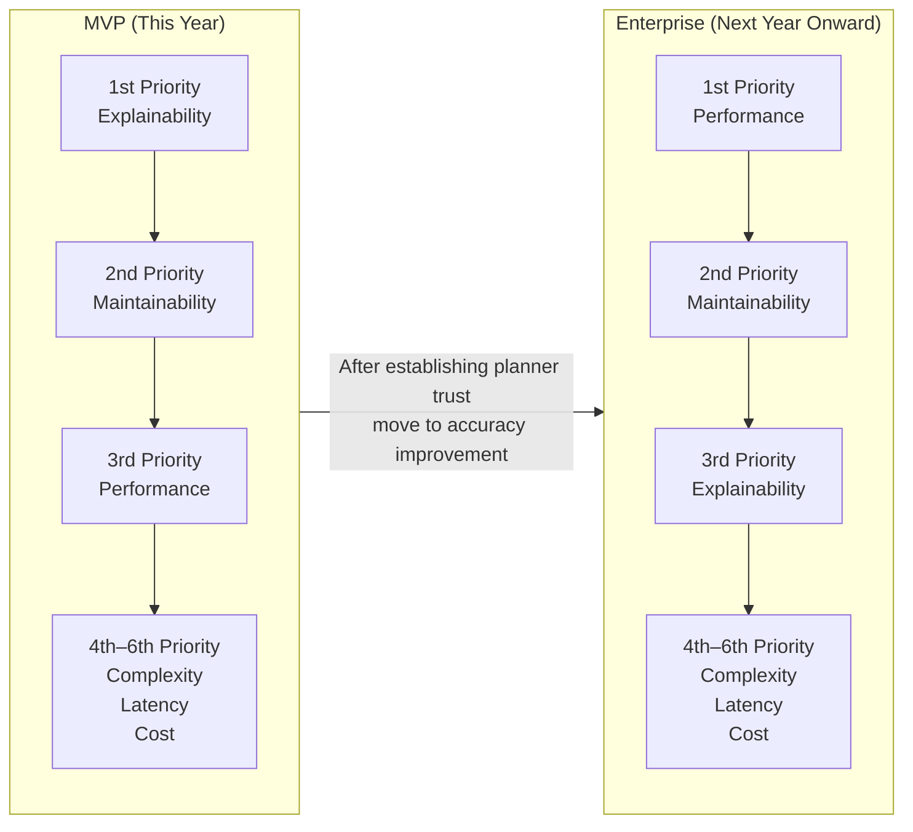

**MVP priority rationale:**

| Priority | Criterion | Rationale |
|---|---|---|
| **1st: Explainability** | For AI forecasts to actually be used in SCM planning, planners must trust the results. Planners are directly responsible for order decisions, so "why was this SKU's demand forecast this way?" must be answerable. No matter how accurate, an unexplainable model will not be adopted. |
| **2nd: Maintainability** | AI Engineers and AI Scientists together form a small team. Complex models increase retraining, debugging, and version management costs, accumulating as technical debt over time. |
| **3rd: Performance** | A level planners can understand and act on creates the possibility of adoption. Performance is improved incrementally after trust is established. |
| **4th–6th** | Latency is tolerable at minute-level given batch processing characteristics. Memory/Cost is not a significant concern at MVP scale. Complexity is already constrained by Explainability and Maintainability priorities. |

**Why priorities invert in Enterprise:** Once planner trust is established in the MVP phase, introducing more complex models for higher accuracy becomes justifiable.

---


---

# Part 4. Execution, Roadmap, Risk, Non-Scope

---

# Section 11. Roles & 90-Day Execution Plan

## 11-1. Project Roles

| Role | Basis |
|---|---|
| **AI Engineer** | Hiring position |
| **AI Scientist** | "statistical or AI models developed by AI Scientists" |
| **Data Engineer** | JD — "Work closely with Data Engineers" |
| **BizOps / Commercial** | JD — "Partner with BizOps and Commercial stakeholders" |
| **SCM Planner (SME)** | "selected internal departments to test applicability" |

---

## 11-2. Ownership by Role

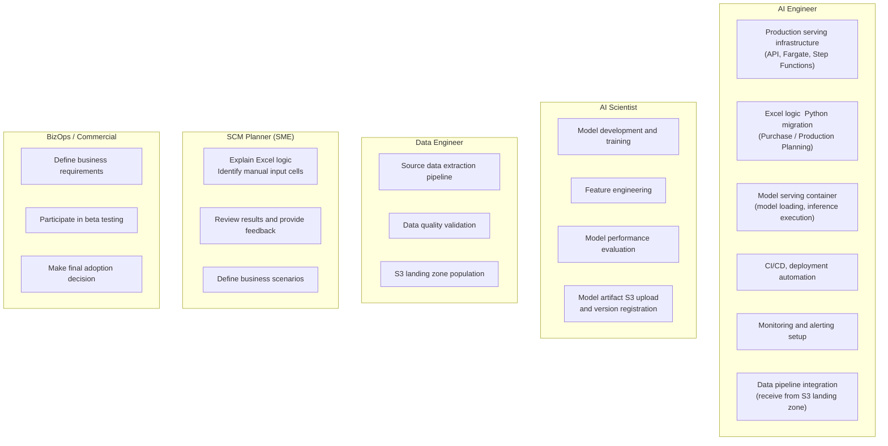

---

## 11-3. AI Engineer Ownership Boundaries

| Directly Owns | Does Not Own (other roles) |
|---|---|
| API endpoint design and implementation | Model training (AI Scientist) |
| Model execution in Fargate container | Source data pipeline construction (Data Engineer) |
| Step Functions workflow configuration | Business scenario definition (BizOps + SME) |
| Excel logic Python rewrite | Interpreting business meaning of Excel formulas (requires SME coordination) |
| Model Registry API implementation and operation | Model artifact S3 upload (AI Scientist) |
| Deployment automation (CI/CD) | Source data quality assurance (Data Engineer) |
| CloudWatch monitoring setup | Beta user onboarding and training (BizOps) |

---

## 11-4. Response to Limited Resource Scenarios

### Scenario A: Data Engineer absent or delayed

| Temporary Response | Method |
|---|---|
| Manual data extraction | Request data files from SME or IT team. Upload manually to S3 |
| Start development with sample data | Continue service development with anonymized samples until real pipeline is connected |
| Pre-define pipeline interface | Document "what data needs to arrive at which S3 path in what format." Data Engineer builds to this interface when available |

### Scenario B: AI Scientist collaboration delayed

| Temporary Response | Method |
|---|---|
| Stub inference | Test E2E pipeline using a stub that returns naive forecasts instead of a real model |
| Agree on interface first | Confirm "what input the model takes and what output it returns" with AI Scientist before proceeding |

### Scenario C: Difficulty securing SME time — the most critical bottleneck

| Response | Method |
|---|---|
| Secure regular sessions in Phase 1 Week 1 | Deferring this leads to permanent deferral. Establish 1–2 weekly sessions on the calendar in the first week |
| Enable async review through documentation | Organize formula analysis results in Notion/Confluence for asynchronous comment-based feedback |
| Negotiate scope reduction | Reduce scope to a specific brand or product line to lower Excel migration burden |

---

## 11-5. Critical Path

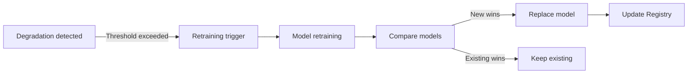

Critical path: `Data access → Inference Container PoC → Step Functions → Purchase Planning → Production Planning → E2E Testing`

Any delay on this path shifts the entire schedule. This is why validating data access and inference container PoC are the top priorities in Phase 1.

---

## 11-6. 90-Day Execution Plan

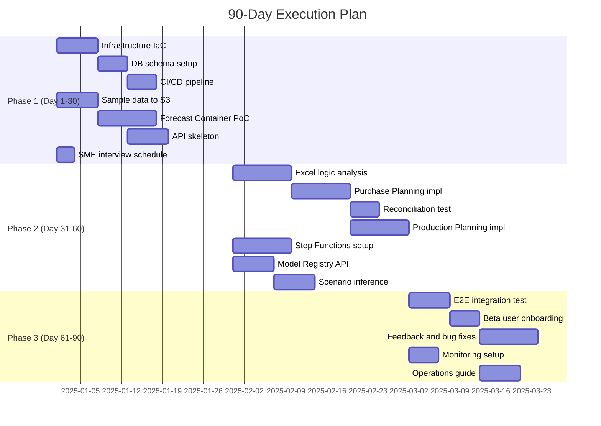

---

## 11-7. Phase Details

### Phase 1: Foundation (Day 1–30)

**Objective:** Confirm and validate decisions that are expensive to change later.

| Task | Detail | Completion Criteria |
|---|---|---|
| **AWS infrastructure IaC** | Configure VPC, Aurora Serverless v2, S3, ECR, ECS cluster using Terraform or AWS CDK | Full infrastructure reproducible with a single `terraform apply` |
| **DB schema + migration** | Create planning data tables, configure Alembic migrations | Verified insert/select on actual data |
| **CI/CD pipeline** | GitHub Actions → ECR push → ECS task definition update | Code push automatically triggers container build and deployment |
| **Sample data** | Anonymized sample with identical structure. Loaded to S3 | In a format the Forecast container can read and process |
| **Forecast Container PoC** | Verify inference operation with AI Scientist-provided model (or stub) | E2E operation confirmed: sample data input → results stored in DB |
| **SME interview schedule** | Confirmed in first week. 1–2 regular sessions per week | Scheduled on calendar |

**Rationale for IaC first:** Infrastructure configured via manual clicks cannot be reproduced. With IaC, identical environments can be recreated on demand with a single `terraform apply`.

**Rationale for CI/CD in Phase 1:** Dozens of deployments occur within 90 days. Manual deployments introduce errors and consume time.

> **Phase 1 Completion Criterion:** The Forecast container reads sample data, runs inference, and stores results in DB — with the entire sequence automatically deployed via a single code push.

---

### Phase 2: Core Logic (Day 31–60)

**Objective:** All three stages — Forecast → Purchase → Production — are connected and operational.

| Task | Detail | Completion Criteria |
|---|---|---|
| **Excel logic analysis** | Document formula structure, manual input cells, dependency order with SME | Step-by-step documentation complete. SME confirmed |
| **Purchase Planning implementation** | Python rewrite of Excel logic, config externalization | Reconciliation test passes (tolerance agreed with SME) |
| **Production Planning implementation** | Rule-based CMO allocation, constraint violation flag generation | Sample purchase plan input → production plan generated |
| **Step Functions workflow** | Sequential execution of Forecast → Purchase → Production, failure handling | DB status updated and alert sent on each stage failure |
| **Model Registry API** | Model registration, query, and version management API | AI Scientist can register model; selectable from UI |
| **Scenario inference** | Parse scenario parameters and apply to model | Baseline vs scenario run results comparable |

> **Phase 2 Completion Criterion:** Forecast → Purchase Planning → Production Planning executes sequentially via Step Functions on sample data. Each stage's results are stored in DB. Purchase Planning output matches Excel within the SME-agreed tolerance.

---

### Phase 3: Integration & Validation (Day 61–90)

**Objective:** Selected internal users use the system and form a judgment on applicability.

| Task | Detail | Completion Criteria |
|---|---|---|
| **E2E integration testing** | Run full flow with real data (if available). Validate result consistency | Completes without errors. DB results verified |
| **Beta user onboarding** | Grant access to 1–2 users from SCM and BizOps each. Provide usage guidance | Users can execute runs independently |
| **Feedback collection** | Structured feedback form + interviews | Sufficient feedback to distinguish "would return to Excel" vs "this is better" |
| **Monitoring setup** | CloudWatch alarms: job failure, abnormal latency | Errors not allowed to go undetected |
| **Operations guide** | Incident response, model registration procedure, config change method | Basic operations possible without engineer involvement |

**Key items to confirm during feedback collection:**
- Can planners understand and explain the forecast results?
- Are results trustworthy compared to Excel?
- Are results usable as a reference for actual order decisions?

> **Phase 3 Completion Criterion:** At least one selected user has executed a run using actual business data, reviewed the results, and provided an opinion on real-world applicability.

---

# Section 12. Enterprise Upgrade Roadmap

## 12-1. Current State and Target State

**Current State (at MVP completion):**
- Modular monolith backend, single operational DB (Aurora Serverless v2), S3
- Step Functions + ECS Fargate-based async inference
- Excel logic migrated to Python (Purchase + Production Planning)
- Beta validation completed with selected internal users
- No automated retraining, no HA/DR

**Target State (end of next year, Enterprise-grade):**
- Automate model retraining that was managed manually this year
- Stabilize data and model operations pipelines
- Decompose services starting from components with clear workload and ownership boundaries
- Expand coverage to more SKUs and markets

**Core principle: Do not discard the existing structure. Add layers and decompose services.**

---

## 12-2. Roadmap Overview

```mermaid
flowchart LR
    subgraph MVP["This Year's MVP"]
        M1["Modular Monolith\n+ Single DB"]
        M2["Manual Batch\nData Snapshot"]
        M3["Rule-based\nProduction Planning"]
        M4["Manual Model Registration\n+ Manual Retraining"]
        M5["Best-effort\nMonitoring"]
    end

    subgraph Q1["Q1: Stabilization + Scaling Foundation"]
        Q1A["SLO Definition\n+ Read Replica"]
        Q1B["Data Pipeline Automation\n+ Lineage"]
        Q1C["Model Drift Detection\n+ Alerts"]
        Q1D["Dev/Stage/Prod Separation"]
    end

    subgraph Q2["Q2: Operational Maturity"]
        Q2A["Automated Retraining\nPipeline"]
        Q2B["Production Planning\nOptimization"]
        Q2C["Enterprise Auth\nRBAC/ABAC"]
    end

    subgraph Q3["Q3: Scale Expansion"]
        Q3A["SKU/Market\nScope Expansion"]
        Q3B["Data Lake\n+ Athena"]
        Q3C["HA/DR Configuration"]
    end

    subgraph Q4["Q4: Governance + Optimization"]
        Q4A["Feature Store Evaluation"]
        Q4B["Audit Trail\nCompliance Enhancement"]
        Q4C["Service Decomposition\nas needed"]
        Q4D["Cost Optimization"]
    end

    MVP --> Q1 --> Q2 --> Q3 --> Q4
```

---

## 12-3. Q1: Data Pipeline Stabilization (Months 1–3)

Automate data collection that was handled manually in the MVP and separate deployment environments.

| MVP | Q1 Target |
|---|---|
| Manual data extraction | Schedule-based automated pipeline |
| Manual verification of data arrival | Automated data arrival notification + quality checks |
| Single environment | Dev / Stage / Prod separation. Prod deployment requires Stage sign-off |

Data pipelines must be stabilized before expanding SKU scope. With an unstable pipeline, it becomes difficult to distinguish data problems from logic problems.

Begin periodically comparing model predictions against actual TRx to detect performance degradation. This detection mechanism is a prerequisite for Q2 retraining automation.

---

## 12-4. Q2: Automated Model Retraining (Months 4–6)

Automate the model retraining process that the AI Scientist handled manually this year.

Q1's performance degradation detection must come first to establish "when to retrain" criteria. Without this, execution frequency cannot be determined.

```mermaid
flowchart LR
    MVP[This Year MVP
Modular Monolith
Manual Operations]
    Q1[Q1 Pipeline Stabilization
Dev/Stage/Prod
Performance Monitoring]
    Q2[Q2 Automate Retraining]
    Q3[Q3 Scope Expansion
More SKUs and Markets]
    Q4[Q4 Service Decomposition
By Workload]

    MVP --> Q1 --> Q2 --> Q3 --> Q4
```

---

## 12-5. Q3: Scope Expansion (Months 7–9)

After pipelines and retraining are stabilized in Q1–Q2, expand to more SKUs and markets.

Expansion order: SKUs with validated data quality first → markets with simpler planning rules → markets with complex constraints last.

This is also when data accumulation begins to cause DB bottlenecks. Respond in the direction described in Section 7 (separate reads/writes, archive historical data separately).

---

## 12-6. Q4: Service Decomposition (Months 10–12)

Decompose components with clear workload and ownership boundaries into independently deployable services.

| Decomposition Criterion | Example |
|---|---|
| Independent deployment needed | Forecasting and Planning have diverged deployment cycles |
| Team ownership separated | AI Scientist team exclusively owns Forecasting |
| Workload characteristics differ | Forecasting needs GPU, Planning only needs CPU |

Decomposing without these criteria only increases operational complexity.

---

## 12-7. MVP Infrastructure Decisions and Their Enterprise Utilization

| MVP Infrastructure Decision | Utilization in Enterprise |
|---|---|
| Containerized inference (Fargate) | Containers migrate as-is for Q2 automated retraining and Q4 service decomposition |
| Modular monolith | Module boundaries serve as service boundaries in Q4 decomposition |
| Aurora Serverless v2 | Progressively enhanced with Read Replica in Q1 and Multi-AZ in Q3. No architectural changes, only layer additions |
| CI/CD (GitHub Actions → ECR → ECS) | Reused across all quarters Q1–Q4. Stages added without replacing the pipeline |

---

# Section 13. Key Risks & Mitigation Plan

## 13-1. Risk Classification

| Probability / Impact | Risk | Response |
|---|---|---|
| 🔴 High / High | Excel Logic Reproduction Accuracy | Immediate mitigation planning |
| 🔴 High / High | Insufficient SME Time | Immediate mitigation planning |
| 🔴 High / High | User Adoption Failure | Immediate mitigation planning |
| 🟡 Medium / High | Data Governance Approval Delay | Prepare response |
| 🟡 Medium / Medium | Model Performance Expectation Mismatch | Prepare response |
| 🟡 Medium / Medium | AI Scientist Interface Misalignment | Prepare response |
| 🟢 Low / Low | AWS Cost Overrun | Accept |

---

## 13-2. Risk Details

### Risk 1. Excel Logic Reproduction Accuracy — Highest Priority

**Root causes:**

| Cause | Example |
|---|---|
| Formula misinterpretation | Nested IF condition order misunderstood |
| Missing manual input cell | Value entered by SME not reflected in code |
| Calculation order error | B references A, but B is computed first |
| Unrecognized Named Range | Names defined in Excel Name Manager overlooked |
| Rounding difference | Minor floating-point handling differences between Excel and Python |

**Preventive mitigation:**
- Write input-output test cases with SME before implementation. Validation criteria must precede development.
- Include Reconciliation test in CI/CD. Automatically compare against Excel output on every code change (tolerance agreed with SME).
- Document and get SME sign-off on Excel sheet structure before beginning implementation.

**Post-occurrence response:**
- Isolate cases with discrepancies and classify causes (formula error / missing manual input / missing exception logic).
- Request SME explanation for the specific case, confirm cause, and fix.
- Transparently document "list of unimplemented exception cases in current version" and address in the next iteration.

---

### Risk 2. Insufficient SME Time

**Root cause:** Planners run both this AI project and actual SCM operations in parallel. Even cooperative initially, their core job takes priority over time.

**Impact if occurs:**
- Excel logic analysis delayed → reproduction accuracy validation blocked → directly connected to Risk 1
- Results review delayed → Phase 3 beta testing delayed

**Preventive mitigation:**
- Establish 1–2 weekly regular sessions in Phase 1 Week 1. Deferring means permanent deferral.
- Enable async review by documenting formula analysis results in Notion/Confluence for comment-based feedback.
- Minimize blocking by running work that does not require SME (infrastructure, API, monitoring) in parallel.

**Post-occurrence response:**
- Negotiate scope reduction to a specific brand or product line.
- Escalate bottleneck situation to PM/project owner.

---

### Risk 3. User Adoption Failure

**Root causes:**

| Cause | Detail |
|---|---|
| Numerical discrepancy | Different results from Excel → trust damaged (linked to Risk 1) |
| UI/UX inconvenience | Perceived as more cumbersome than Excel |
| Unexplainable results | Model results cannot answer "why this number?" |
| Learning cost | Burden of learning a new system |

**Preventive mitigation:**
- Frame MVP goal as "a tool to use alongside Excel" rather than "an Excel replacement." Forcing replacement generates resistance.
- Present statistical model results and AI model results side by side. Let planners judge independently, without pushing AI as superior.
- Before Phase 3 beta testing, clearly communicate MVP's purpose and what not to expect from it.
- Directly connected to the strategy of using an Explainability-first model as default.

**Post-occurrence response:**
- Collect planner feedback structured by type: "numbers are different so unusable" / "UI is cumbersome" / "model explanation is inadequate."
- Respond based on type: numbers → Risk 1 response / UI → fast iteration / explanation → reconsider model selection.

---

### Risk 4. Data Governance Approval Delay

**Reframing:** This risk is not about data quality — data has already been validated at the level used in existing Excel planning. The issue is **approval for moving existing data to the cloud (AWS)**.

**Preventive mitigation:**
- Run the approval process in parallel with Phase 1 start. Separate technical development from approval.
- Proceed with technical development using anonymized/masked sample data until approval is obtained.
- Identify the minimum necessary data scope rather than full data migration to narrow the approval scope.

**Post-occurrence response:**
- Prioritize tasks that do not require data (infrastructure, API, Excel migration) during the approval delay period.
- Design the system to complete the E2E flow with anonymized data, with only the real data connection remaining.

---

### Risk 5. Model Performance Expectation Mismatch

**Preventive mitigation:**
- Before Phase 3 beta testing, clearly communicate that "this year's MVP goal is validating workflow connection, not achieving perfect forecast accuracy."
- Always present statistical model results alongside AI model for relative comparison. Relative improvement is more persuasive than absolute metrics.
- Establish the expectation that "model accuracy improves as data accumulates and feedback is incorporated" as part of the roadmap narrative.

---

---

## 13-3. Risk Summary Table

| Risk | Probability | Impact | Key Mitigation |
|---|---|---|---|
| **Excel logic reproduction accuracy** | High | High | Write test cases before implementation. Include Reconciliation test in CI/CD |
| **Insufficient SME time** | High | High | Secure regular sessions in Week 1. Document for async review |
| **User adoption failure** | High | High | "Alongside" not "replace" framing. Explainability-first model as default |
| **Data governance approval delay** | Medium | High | Run approval and development in parallel. Start with sample data |
| **Model performance expectation mismatch** | Medium | Medium | Communicate MVP purpose in advance. Always show statistical model results alongside AI results |
| **AI Scientist interface misalignment** | Medium | Medium | Agree on model interface in Phase 1 |
| **AWS cost overrun** | Low | Low | Monitor Serverless usage. Adjust scaling policies on projected overrun |

---

# Section 14. Intentional Non-Scope

## Scope Definition

This section documents items that AI Engineers directly own in terms of architecture and serving decisions, and have intentionally excluded this year. Team-level roadmap decisions (optimization algorithm selection, market expansion scope, HA/DR configuration, etc.) are outside this list's scope. This list addresses only **architecture and serving choices directly owned and decided by the AI Engineer**.

---

## 1. Real-time Streaming Inference

**Rationale for exclusion:**
SCM planning does not require real-time processing. The planner workflow involves reviewing forecast results and making order decisions, where waiting minutes is acceptable.

Building a Kinesis-based streaming pipeline requires:
- Exactly-once processing guarantees, late data handling, and consumer group management
- These are infrastructure tasks unrelated to the core MVP value (validating workflow connectivity)
- A small engineering team cannot sustain streaming infrastructure while developing planning logic simultaneously

**Alternative:** Async batch job (Step Functions + Fargate). Completes within minutes of clicking the Run button.

---

## 2. Automated Retraining Pipeline

**Rationale for exclusion:**
For an automated retraining pipeline to operate correctly, the following must exist first:
- **Model drift detection:** Without criteria for "when to retrain," execution frequency cannot be determined
- **Champion/challenger comparison criteria:** A basis for determining whether a new model outperforms the current one is required
- **Validated training data pipeline:** Retraining on incorrect data degrades model performance

Building automated retraining without this foundation creates an automated performance degradation pipeline.

**Alternative:** Model Registry API + AI Scientist manual model registration and version management
**Next year:** Drift detection (Q1) → Automated retraining (Q2)

---

## 3. Microservices Architecture

**Rationale for exclusion:**

| Cost Item | Detail |
|---|---|
| Separate CI/CD per service | Deployment pipeline management cost × service count |
| Forecast → Purchase → Production in different services | Mid-stage failures require distributed transaction rollback (Saga pattern) |
| Logs distributed across services | Requires correlation ID-based distributed tracing |
| Local development | Multiple services must be running simultaneously to test a single feature |

**Alternative:** Modular monolith. Internal modules are clearly separated but deployed as a single service
**Next year:** Decompose only necessary services when workload and ownership are clear (Q4)

---

## 4. Full MLOps Platform

**Rationale for exclusion:**
A full MLOps platform (MLflow, SageMaker Pipelines, Kubeflow) requires dedicated operations staff to deliver value. Investing AI Engineer resources in platform operations prevents focus on planning logic development.

Two things are needed in MVP:
- Which model produced which results → resolved with run history + Model Registry
- Where are the model files → resolved with Model Registry + S3

**Alternative:** Model Registry API + S3 artifact storage + manual version management
**Next year:** MLOps level progressively raised as drift detection and automated retraining are added

---

## Non-Scope Summary

| Item | Rationale | Alternative |
|---|---|---|
| **Streaming Inference** | SCM does not require real-time. exactly-once processing adds operational burden | Async batch |
| **Automated Retraining** | Without drift detection in place, automation degrades model performance | Manual retraining → automate in Q2 |
| **Microservices** | Deployment and transaction overhead exceeds value for a small team | Modular monolith → decompose in Q4 |
| **Full MLOps Platform** | Cannot sustain without dedicated operations staff | Model Registry + S3 as substitute |

---

# References

| Metric / Claim | Source | Year Verified |
|---|---|---|
| Lambda maximum execution time 15 minutes (900 sec) | [AWS Lambda FAQs](https://aws.amazon.com/lambda/faqs/) | 2025 |
| Lambda maximum memory 10,240 MB | [AWS Lambda FAQs](https://aws.amazon.com/lambda/faqs/) | 2025 |
| Lambda default concurrency limit 1,000 | [AWS Lambda FAQs](https://aws.amazon.com/lambda/faqs/) | 2025 |
| API Gateway HTTP API integration timeout 29 sec (not extendable) | [AWS re:Post](https://repost.aws/knowledge-center/api-gateway-timeout-limit) | 2025 |
| API Gateway Regional REST API timeout extendable (Jun 2024) | [AWS What's New](https://aws.amazon.com/about-aws/whats-new/2024/06/amazon-api-gateway-integration-timeout-limit-29-seconds/) | 2024.06 |
| MWAA small environment $0.49/hr (2023 basis; micro tier added Nov 2024) | [AWS Blog 2023](https://aws.amazon.com/blogs/compute/automating-stopping-and-starting-amazon-mwaa-environments-to-reduce-cost/), [MWAA micro Nov 2024](https://aws.amazon.com/about-aws/whats-new/2024/11/amazon-mwaa-smaller-environment-size/) | 2023/2024 |
| Aurora Serverless v2 maximum 256 ACUs (Oct 2024) | [AWS What's New](https://aws.amazon.com/about-aws/whats-new/2024/10/amazon-aurora-serverless-v2-256-acus) | 2024.10 |
| Aurora Serverless v2 zero-scale support (Nov 2024) | [AWS What's New](https://aws.amazon.com/about-aws/whats-new/2024/11/amazon-aurora-serverless-v2-scaling-zero-capacity/) | 2024.11 |
| Aurora Serverless v2 1 ACU ≈ 2 GiB RAM | [AWS Aurora Documentation](https://docs.aws.amazon.com/AmazonRDS/latest/AuroraUserGuide/aurora-serverless-v2.how-it-works.html) | 2024 |
| openpyxl does not evaluate formulas; xlwings incompatible with Linux | [openpyxl docs](https://openpyxl.readthedocs.io/en/stable/), [xlwings FAQ](https://www.xlwings.org/support) | 2024 |
| ECS Fargate cold start 30–90 sec (ENI provisioning + image pull) | AWS official response | 2024 |
| Step Functions Standard Workflow max 1 year; Express max 5 min | [AWS Step Functions Documentation](https://docs.aws.amazon.com/step-functions/latest/dg/concepts-standard-vs-express.html) | 2024 |

---

*Document Version: v1.0*
*Based on: SCM AI Planning Engineering Design Final (Internal Review) v2.0*
*Last Updated: 2025*